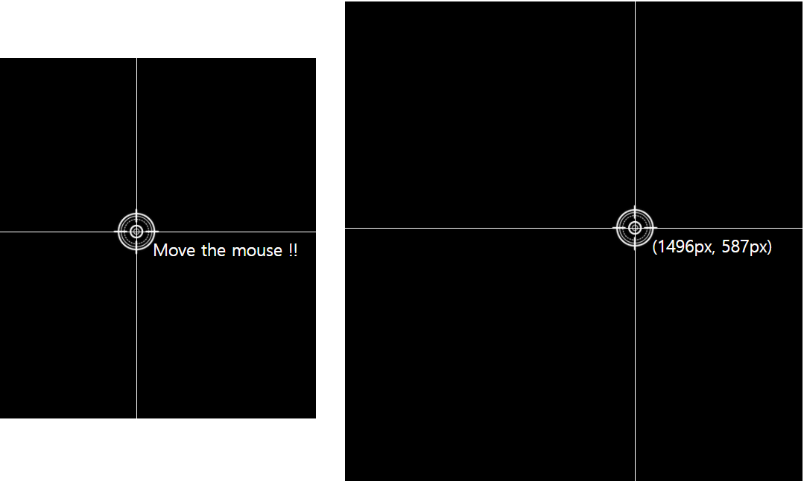

## WEB API MINI GAME

> 웹 API를 사용해서 좌표를 이용한 미니게임
>
>  https://junghyukjin.github.io/coordinate007_mini_game/index.html <<< Click!!!



```css
// style.css

body {
  background-color: black;
}

.line {
  position: absolute;
  /* 원하는 곳에 자유자재로 움직일 수 있도록 absolute로 */
  background-color: white;
}

.horizontal {
  width: 100%;
  height: 1px;
  top: 50%;
}

.vertical {
  height: 100%;
  width: 1px;
  left: 50%;
}

.target {
  position: absolute;
  top: 50%;
  left: 50%;
  transform: translate(-50%, -50%);
  /* top과 left만 50%로 중앙을 설정하면, 이미지의 좌측 상단 꼭지점이 중간으로 가게 된다. */
  /* 이미지를 정 중앙에 두고 싶으면, 꼭 transform으로 translate X,Y 값을 -50%으로 설정해줘야 한다. */
}

.tag {
  color: white;
  position: absolute;
  top: 50%;
  left: 50%;
  transform: translate(25px, 10px);
  font-size: 25px;
}
```

```html
// index.html

<!DOCTYPE html>
<html lang="en">
<head>
  <meta charset="UTF-8">
  <meta name="viewport" content="width=device-width, initial-scale=1.0">
  <title>Document</title>
  <script src="main.js" defer></script>
  <link rel="stylesheet" href="style.css"></li>
</head>
<body>
  <div class="line horizontal"></div>
  <div class="line vertical"></div>
  
  <span class="tag">Move the mouse !!</span>
</body>
</html>
```

```js
// main.js

const vertical = document.querySelector('.vertical');
const horizontal = document.querySelector('.horizontal');
const target = document.querySelector('.target');
const tag = document.querySelector('.tag');

document.addEventListener('mousemove', (event) => {
  // 마우스를 움직 일 때 항상 event가 발생, 항상 event가 발생하고, 오브젝트가 전달되기 때문에 param에 받아준다.
  // console.log('move');
  // console.log(`${event.clientX} ${event.clientY}`);
  // 로그를 찍어서 정상적으로 작동하는지 개발자모드로 확인 후 개발을 하자.
  const x = event.clientX;
  const y = event.clientY;
  console.log(`${x} ${y}`);

  vertical.style.left = `${x}px`;
  horizontal.style.top = `${y}px`;
  target.style.left = `${x}px`;
  target.style.top = `${y}px`;
  tag.style.left = `${x}px`;
  tag.style.top = `${y}px`;
  tag.innerHTML = `(${x}px, ${y}px)`;
});
```

