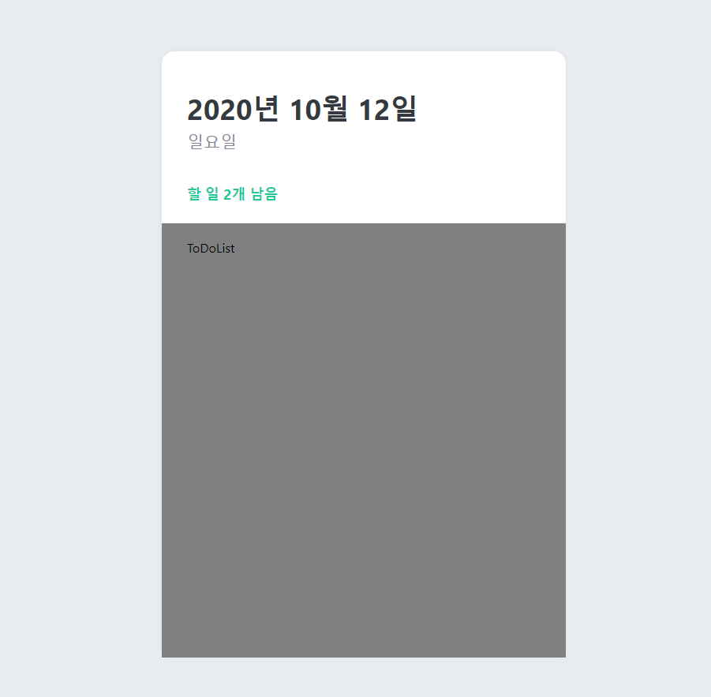
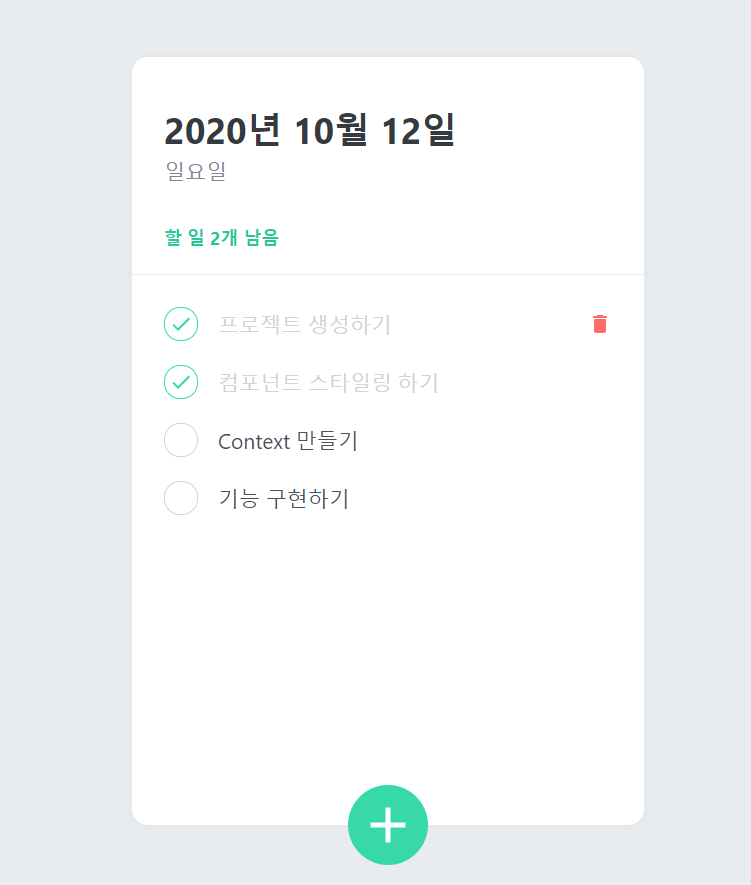
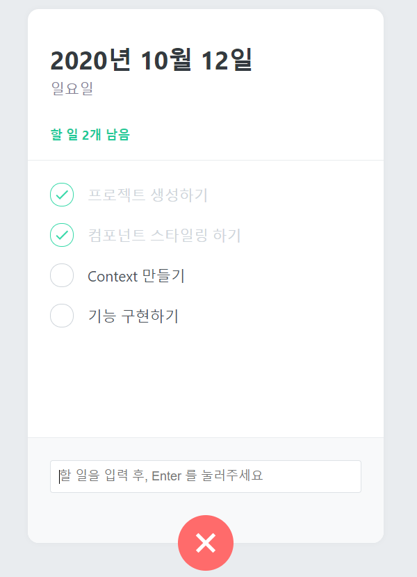
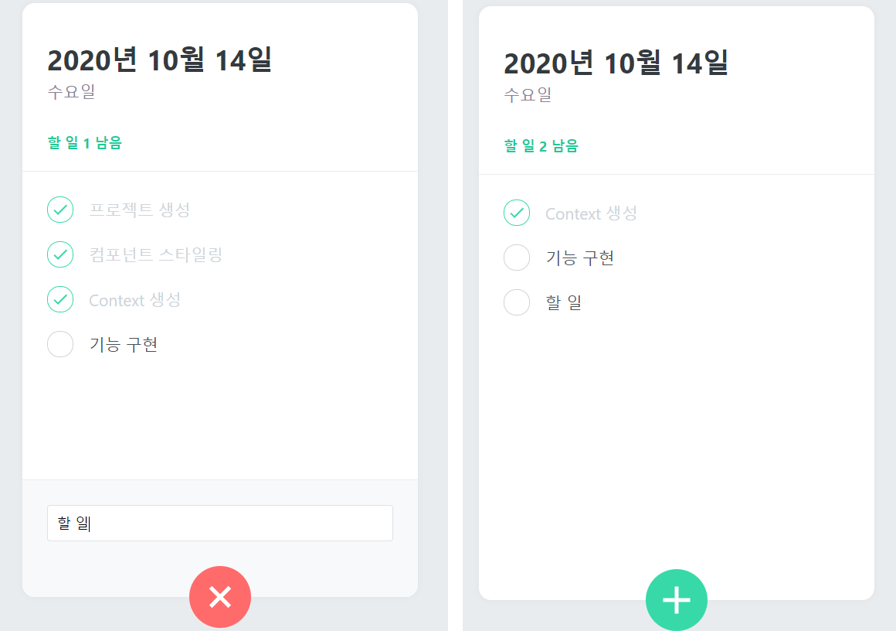

## To Do List App

### GlobalStyle 설정

- 우선 페이지 전체를 회색배경으로 바꿔보자.
- styled-components를 사용해서 body에 넣는 global style을 넣으려면 어떻게 해야 하는지 알아보자.

```jsx
// App.js

import React from 'react';
import { createGlobalStyle } from 'styled-components';
// 

const GlobalStyle = createGlobalStyle`
  body{
    background : #e9ecef;
  }
`;

function App() {
  return (
    <>
      <GlobalStyle />
      <div>안녕하세요!!</div>
    </>
  );
}

export default App;
```

> GlobalStyle을 무조건 만들 필요는 없지만, CSS파일을 만들어 작성하는 방법 외에 이런 방법이 있다고만 알아두자.

---

---


### 다음은 template, head, list를 만들어보자.

```jsx
// App.js

import React from 'react';
import { createGlobalStyle } from 'styled-components';
import ToDoTemplate from './components/ToDoTemplate';
import ToDoHead from './components/ToDoHead';
import ToDoList from './components/ToDoList';

const GlobalStyle = createGlobalStyle`
  body{
    background : #e9ecef;
  }
`;

function App() {
  return (
    <>
      <GlobalStyle />
      <ToDoTemplate>
        <ToDoHead />
        <ToDoList />
      </ToDoTemplate>
    </>
  );
}

export default App;
```


```jsx
// ToDoTemplate.js

import React from 'react';
import styled from 'styled-components';

const ToDoTemplateBlock = styled.div`
  width: 512px;
  height: 768px;

  position: relative;
  /* 해당 속성은 이후에 초록색 플러스 버튼을 투두템플릿 내부의 최하단에 */
  /* 렌더링을 해야하는데, 그 때 필요하다. */
  background: white;
  border-radius: 16px;
  box-shadow: 0 0 8px rgba(0, 0, 0, 0.04);

  margin: 0 auto;
  /* 페이지 중앙 설정 */
  margin-top: 96px;
  margin-bottom: 32px;

  display: flex;
  flex-direction: column;
`;

function ToDoTemplate({ children }) {
  return <ToDoTemplateBlock>{children}</ToDoTemplateBlock>;
}

export default ToDoTemplate;
```


```jsx
// ToDoHead.js

import React from 'react';
import styled from 'styled-components';

const ToDoHeadBlock = styled.div`
  /* 내부에는 현재 날짜, 요일, 항목리스트가 있다. */
  /* const DateText = styeld.h1 이런식으로 작성하지 않고 아래방식처럼 nested CSS문법을 사용한다. */
  padding-top: 48px;
  padding-left: 32px;
  padding-right: 32px;
  padding-bottom: 24px;
  border-bottom: 1px solid #e9ecef;

  h1 {
    margin: 0;
    font-size: 36px;
    color: #343a40;
  }

  .day {
    margin-top: 4px;
    color: #868396;
    font-size: 21px;
  }

  .tasks-left {
    color: #20c997;
    font-size: 18px;
    margin-top: 40px;
    font-weight: bold;
  }
`;

function ToDoHead() {
  return (
    <ToDoHeadBlock>
      <h1>2020년 10월 12일</h1>
      <div className="day">일요일</div>
      <div className="tasks-left">할 일 2개 남음</div>
    </ToDoHeadBlock>
  );
}

export default ToDoHead;
```


```jsx
// ToDoList.js

import React from 'react';
import styled from 'styled-components';

const ToDoListBlock = styled.div`
  flex: 1;
  /* ToDoTemplate에서 display: flex와 flex-direction: column을 설정했기 때문에,*/
  /* fleX:1을 주면 자신이 차지할 수 있는 공간을 전부 차지한다. */
  padding: 20px 32px;
  padding-bottom: 48px;
  overflow-y: auto;
  /* 항복이 많아지면 스크롤바를 보여줄 것임 */
  background: gray;
`;

function ToDoList() {
  return <ToDoListBlock>ToDoList</ToDoListBlock>;
}

export default ToDoList;
```



---

---


```jsx
// ToDoList.js

import React from 'react';
import styled from 'styled-components';
import ToDoItem from './ToDoItem';

const ToDoListBlock = styled.div`
  flex: 1;
  /* ToDoTemplate에서 display: flex와 flex-direction: column을 설정했기 때문에,*/
  /* fleX:1을 주면 자신이 차지할 수 있는 공간을 전부 차지한다. */
  padding: 20px 32px;
  padding-bottom: 48px;
  overflow-y: auto;
  /* 항목이 많아지면 스크롤바를 보여줄 것임 */
`;

function ToDoList() {
  return (
    <ToDoListBlock>
      <ToDoItem text="프로젝트 생성하기" done={true} />
      <ToDoItem text="컴포넌트 스타일링 하기" done={true} />
      <ToDoItem text="Context 만들기" done={false} />
      <ToDoItem text="기능 구현하기" done={false} />
    </ToDoListBlock>
  );
}

export default ToDoList;
```

```jsx
// ToDoCreate.js

import React from 'react';
import styled, { css } from 'styled-components';
import { MdAdd } from 'react-icons/md';

const CircleButton = styled.button`
  background: #38d9a9;
  &:hover {
    background: #63e6be;
  }
  &:active {
    background: #20c997;
  }

  z-index: 5;
  /* 다른 내용을 가리기 위해 설정 */
  cursor: pointer;
  width: 80px;
  height: 80px;
  display: flex;
  align-items: center;
  justify-content: center;

  position: absolute;
  left: 50%;
  bottom: 0px;
  transform: translate(-50%, 50%);
  /* 위의 코드를 사용하지 않으면, 정 중앙으로 가지 않는다. 버튼의 크기 때문. */
  /* 위 코드를 사용함으로써 해당 버튼 크기의 50%만큼 좌/하단으로 움직여 정중앙에 맞춰준다. */

  font-size: 60px;
  color: white;
  border-radius: 40px;

  border: none;
  outline: none;
`;

function ToDoCreate() {
  return (
    <CircleButton>
      <MdAdd />
    </CircleButton>
  );
}

export default ToDoCreate;
```

```jsx
// ToDoItem.js

import React from 'react';
import styled, { css } from 'styled-components';
import { MdDone, MdDelete } from 'react-icons/md';

const Remove = styled.div`
  opacity: 0;
  /* ToDoItemBlock에 커서를 올렸을 때만 보여지게 만든다. */
  display: flex;
  align-items: center;
  justify-content: center;
  color: #dee2e6;
  font-size: 24px;
  cursor: pointer;
  &:hover {
    color: #ff6b6b;
  }
`;
const CheckCircle = styled.div`
  width: 32px;
  height: 32px;
  border-radius: 16px;
  border: 1px solid #ced4da;
  font-size: 24px;
  display: flex;
  align-items: center;
  justify-content: center;
  margin-right: 20px;
  cursor: pointer;

  /* 만약 done이 존재한다면 색상을 바꿔줄 것이기 때문에, 여러줄의 스타일이 필요하다. */
  /* 상단에서 css를 불러오자. */
  ${(props) =>
    props.done &&
    css`
      border: 1px solid #38d9a9;
      color: #38d9a9;
      /* done값이 있다면 테두리와 색상값을 바꾼다. */
    `}
`;
const Text = styled.div`
  flex: 1;
  font-size: 21px;
  color: #495057;
  ${(props) =>
    props.done &&
    css`
      color: #ced4da;
    `}
`;
const ToDoItemBlock = styled.div`
  display: flex;
  align-items: center;
  padding-top: 12px;
  padding-bottom: 12px;
  &:hover {
    ${Remove} {
      /* 이런식으로 컴포넌트를 바로 선택해서 속성을 줄 수 있다. */
      opacity: 1;
    }
  }
`;

function ToDoItem({ id, done, text }) {
  //
  return (
    <ToDoItemBlock>
      <CheckCircle done={done}>{done && <MdDone />}</CheckCircle>
      <Text done={done}>{text}</Text>
      <Remove>
        <MdDelete />
      </Remove>
    </ToDoItemBlock>
  );
}

export default ToDoItem;
```

- 여러개의 components를 만들었는데 Remove는 우측에서 나타나게 될 쓰레기통 모양의 아이콘 컴포넌트고,
- CheckCircle은 좌측에 보여지는 체크상태를 보여주는 체크 컴포넌트, 
- Text는 텍스트를 보여주는 컴포넌트,
- ToDoItemBlock 내부에 위 세개의 내용이 보여지게 된다.



---

---


### ToDoCreate는 열고 닫을 수 있어야 한다. 상태관리를 추가해보자.

```jsx
// ToDoCreate.js

import React, { useState } from 'react';
import styled, { css } from 'styled-components';
import { MdAdd } from 'react-icons/md';

const CircleButton = styled.button`
  background: #38d9a9;
  &:hover {
    background: #63e6be;
  }
  &:active {
    background: #20c997;
  }

  z-index: 5;
  /* 다른 내용을 가리기 위해 설정 */
  cursor: pointer;
  width: 80px;
  height: 80px;
  display: flex;
  align-items: center;
  justify-content: center;

  position: absolute;
  left: 50%;
  bottom: 0px;
  transform: translate(-50%, 50%);
  /* 위의 코드를 사용하지 않으면, 정 중앙으로 가지 않는다. 버튼의 크기 때문. */
  /* 위 코드를 사용함으로써 해당 버튼 크기의 50%만큼 좌/하단으로 움직여 정중앙에 맞춰준다. */

  font-size: 60px;
  color: white;
  border-radius: 40px;

  border: none;
  outline: none;

  /* 애니메이션 효과를 주기위해 트랜지션을 추가해줘야한다. */
  transition: 0.125s all ease-in;
  ${(props) =>
    props.open &&
    css`
      background: #ff6b6b;
      &:hover {
        background: #ff8787;
      }
      &:active {
        background: #fa5252;
      }
      transform: translate(-50%, 50%) rotate(45deg); ;
    `};
`;

const InsertFormPositioner = styled.div`
  width: 100%;
  bottom: 0;
  left: 0;
  position: absolute;
`;

const InsertForm = styled.div`
  background: #f8f9fa;
  padding: 32px;
  padding-bottom: 72px;
  border-bottom-left-radius: 16px;
  border-bottom-right-radius: 16px;
  border-top: 1px solid #e9ecef;
`;

const Input = styled.input`
  padding: 12px;
  border-radius: 4px;
  border: 1px solid #dee2e6;
  width: 100%;
  outline: none;
  font-size: 18px;
  box-sizing: border-box;
  /* 박스사이징 보더박스를 설정하지 않으면 padding을 무시하고 적용된다. */
`;

function ToDoCreate() {
  const [open, setOpen] = useState(false);
  const onToggle = () => setOpen(!open);

  return (
    <>
      {open && (
        <InsertFormPositioner>
          <InsertForm>
            <Input
              placeholder="할 일을 입력 후, Enter 를 눌러주세요"
              autoFocus
            />
          </InsertForm>
        </InsertFormPositioner>
      )}
      <CircleButton onClick={onToggle} open={open}>
        <MdAdd />
      </CircleButton>
    </>
  );
}

export default ToDoCreate;
```



- +버튼을 누를시 활성화가 된 모습이다.
- 이제 모든 UI작업이 끝났다. 기능구현을 시작해보자.

---

---


### 기능 구현을 시작하기 전에 context API를 사용하여 구조를 바꿔보자.

> 무조건 context API를 사용하는 것은 좋은 방법은 아니다, 하지만, 이후에 프로젝트의 규모가 커질때 매우 유용하다.

1. ##### 첫번째로 해야 할 일은 ToDoContext파일을 만들고 그 안에 리듀서를 만드는 것이다.

```jsx
// ToDoContext.js

import React, { useReducer, createContext, useContext, useRef } from 'react';
// useRef는 id값 관리, 상태관리가 아니라, 바로 변화 시킬 수 있는 값

const initialTodos = [
  { id: 1, text: '프로젝트 생성', done: true },
  { id: 1, text: '컴포넌트 스타일링', done: true },
  { id: 1, text: 'Context 생성', done: false },
  { id: 1, text: '기능 구현', done: false },
];

// 세가지 action을 만들어보자.
// Create
// Toggle
// Remove
function todoReducer(state, action) {
  switch (action.type) {
    case 'CREATE':
      return state.concat(action.todo);
    case 'TOGGLE':
      return state.map(
        // 모든 todo에대하여 변환을 해줄 것이다.
        (todo) => (todo.id === action.id ? { ...todo, done: !todo.done } : todo)
      );
    case 'REMOVE':
      return state.filter((todo) => todo.id !== action.id);

    default:
      throw new Error(`Unhandled action type: ${action.type}`);
  }
}

const ToDoStateContext = createContext();
const ToDoDispatchContext = createContext();
const ToDoNextIdContext = createContext();

export function ToDoProvider({ children }) {
  const [state, dispatch] = useReducer(todoReducer, initialTodos);
  const nextId = useRef(5);

  return (
    <ToDoStateContext.Provider value={state}>
      <ToDoDispatchContext.Provider value={dispatch}>
        <ToDoNextIdContext.Provider value={nextId}>
          {children}
        </ToDoNextIdContext.Provider>
      </ToDoDispatchContext.Provider>
    </ToDoStateContext.Provider>
  );
}

// const state = useContext(ToDoStateContext);
// 이렇게 ToDoContext자체를 불러와서 사용할 수 있지만,
// 상단에서 useContext를 불러와 커스텀 훅을 만들어 사용해보자.

export function useToDoState() {
  return useContext(ToDoStateContext);
}

export function useToDoDispatch() {
  return useContext(ToDoDispatchContext);
}

export function useToDoNextId() {
  return useContext(ToDoNextIdContext);
}
```

```jsx
// ToDoList.js

import React from 'react';
import styled from 'styled-components';
import ToDoItem from './ToDoItem';
import { useToDoState } from './ToDoContext';

const ToDoListBlock = styled.div`
  flex: 1;
  /* ToDoTemplate에서 display: flex와 flex-direction: column을 설정했기 때문에,*/
  /* fleX:1을 주면 자신이 차지할 수 있는 공간을 전부 차지한다. */
  padding: 20px 32px;
  padding-bottom: 48px;
  overflow-y: auto;
  /* 항목이 많아지면 스크롤바를 보여줄 것임 */
`;

function ToDoList() {
  const state = useToDoState();
  // ToDoContext에서 만든 커스텀 훅을 이렇게 간단히 사용할 수 있다.
  return (
    <ToDoListBlock>
      <ToDoItem text="프로젝트 생성하기" done={true} />
      <ToDoItem text="컴포넌트 스타일링 하기" done={true} />
      <ToDoItem text="Context 만들기" done={false} />
      <ToDoItem text="기능 구현하기" done={false} />
    </ToDoListBlock>
  );
}

export default ToDoList;
```

- 훅과 컨텍스트를 만드는 작업들이 끝나고 추가적으로 해주면 좋은 작업이 있다. 바로 context가 없을 때 에러처리를 하는 것이다. context를 사용하려면 앱 컴포넌트를 ToDoProvider로 감싸줘야 한다. 만약에 감싸지 않은 상태에서 사용하려면 에러를 발생하게끔 만들어 줘야한다. 꼭 필요한 작업은 아니지만, 습관화하면 좋은 방법이다. 실수를 했을 때 빠르게 알 수 있기 때문이다.

```jsx
// App.js

import React from 'react';
import { createGlobalStyle } from 'styled-components';
import ToDoTemplate from './components/ToDoTemplate';
import ToDoHead from './components/ToDoHead';
import ToDoList from './components/ToDoList';
import ToDoCreate from './components/ToDoCreate';
import { ToDoProvider } from './components/ToDoContext';

const GlobalStyle = createGlobalStyle`
  body{
    background : #e9ecef;
  }
`;

function App() {
  return (
    <ToDoProvider>
      <GlobalStyle />
      <ToDoTemplate>
        <ToDoHead />
        <ToDoList />
        <ToDoCreate />
      </ToDoTemplate>
    </ToDoProvider>
  );
}

export default App;
```

```jsx
// ToDoContext.js

import React, { useReducer, createContext, useContext, useRef } from 'react';

const initialTodos = [
  { id: 1, text: '프로젝트 생성', done: true },
  { id: 2, text: '컴포넌트 스타일링', done: true },
  { id: 3, text: 'Context 생성', done: false },
  { id: 4, text: '기능 구현', done: false },
];

function todoReducer(state, action) {
  switch (action.type) {
    case 'CREATE':
      return state.concat(action.todo);
    case 'TOGGLE':
      return state.map(
        // 모든 todo에대하여 변환을 해줄 것이다.
        (todo) => (todo.id === action.id ? { ...todo, done: !todo.done } : todo)
      );
    case 'REMOVE':
      return state.filter((todo) => todo.id !== action.id);

    default:
      throw new Error(`Unhandled action type: ${action.type}`);
  }
}

const ToDoStateContext = createContext();
const ToDoDispatchContext = createContext();
const ToDoNextIdContext = createContext();

export function ToDoProvider({ children }) {
  const [state, dispatch] = useReducer(todoReducer, initialTodos);
  const nextId = useRef(5);

  return (
    <ToDoStateContext.Provider value={state}>
      <ToDoDispatchContext.Provider value={dispatch}>
        <ToDoNextIdContext.Provider value={nextId}>
          {children}
        </ToDoNextIdContext.Provider>
      </ToDoDispatchContext.Provider>
    </ToDoStateContext.Provider>
  );
}

export function useToDoState() {
  const context = useContext(ToDoStateContext);
  if (!context) {
    throw new Error('Cannot find ToDoProvider');
  }
  return context;
}

export function useToDoDispatch() {
  const context = useContext(ToDoDispatchContext);
  if (!context) {
    throw new Error('Cannot find ToDoProvider');
  }
  return context;
}

export function useToDoNextId() {
  const context = useContext(ToDoNextIdContext);
  if (!context) {
    throw new Error('Cannot find ToDoProvider');
  }
  return context;
}
```

```jsx
// ToDoList.js

import React from 'react';
import styled from 'styled-components';
import ToDoItem from './ToDoItem';
import { useToDoState } from './ToDoContext';

const ToDoListBlock = styled.div`
  flex: 1;
  /* ToDoTemplate에서 display: flex와 flex-direction: column을 설정했기 때문에,*/
  /* fleX:1을 주면 자신이 차지할 수 있는 공간을 전부 차지한다. */
  padding: 20px 32px;
  padding-bottom: 48px;
  overflow-y: auto;
  /* 항목이 많아지면 스크롤바를 보여줄 것임 */
`;

function ToDoList() {
  const state = useToDoState();
  // ToDoContext에서 만든 커스텀 훅을 이렇게 간단히 사용할 수 있다.

  return (
    <ToDoListBlock>
      <ToDoItem text="프로젝트 생성하기" done={true} />
      <ToDoItem text="컴포넌트 스타일링 하기" done={true} />
      <ToDoItem text="Context 만들기" done={false} />
      <ToDoItem text="기능 구현하기" done={false} />
    </ToDoListBlock>
  );
}

export default ToDoList;
```

---

---


## 기능 구현을 시작해보자

```jsx
// ToDoHead.js

import React from 'react';
import styled from 'styled-components';
import { useToDoState } from './ToDoContext';

const ToDoHeadBlock = styled.div`
  /* 내부에는 현재 날짜, 요일, 항목리스트가 있다. */
  /* const DateText = styeld.h1 이런식으로 작성하지 않고 아래방식처럼 nested CSS문법을 사용한다. */
  padding-top: 48px;
  padding-left: 32px;
  padding-right: 32px;
  padding-bottom: 24px;
  border-bottom: 1px solid #e9ecef;

  h1 {
    margin: 0;
    font-size: 36px;
    color: #343a40;
  }

  .day {
    margin-top: 4px;
    color: #868396;
    font-size: 21px;
  }

  .tasks-left {
    color: #20c997;
    font-size: 18px;
    margin-top: 40px;
    font-weight: bold;
  }
`;

function ToDoHead() {
  const todos = useToDoState();
  const undoneTasks = todos.filter((todo) => !todo.done);

  const today = new Date();
  const dateString = today.toLocaleDateString('ko-KR', {
    year: 'numeric',
    month: 'long',
    day: 'numeric',
  });
  const dayName = today.toLocaleDateString('ko-KR', {
    weekday: 'long',
  });

  return (
    <ToDoHeadBlock>
      <h1>{dateString}</h1>
      <div className="day">{dayName}</div>
      <div className="tasks-left">할 일 {undoneTasks.length} 남음</div>
    </ToDoHeadBlock>
  );
}

export default ToDoHead;
```

```jsx
// ToDoCreate.js

import React, { useState } from 'react';
import styled, { css } from 'styled-components';
import { MdAdd } from 'react-icons/md';
import { useToDoNextId, useToDoDispatch } from './ToDoContext';

const CircleButton = styled.button`
  background: #38d9a9;
  &:hover {
    background: #63e6be;
  }
  &:active {
    background: #20c997;
  }

  z-index: 5;
  /* 다른 내용을 가리기 위해 설정 */
  cursor: pointer;
  width: 80px;
  height: 80px;
  display: flex;
  align-items: center;
  justify-content: center;

  position: absolute;
  left: 50%;
  bottom: 0px;
  transform: translate(-50%, 50%);
  /* 위의 코드를 사용하지 않으면, 정 중앙으로 가지 않는다. 버튼의 크기 때문. */
  /* 위 코드를 사용함으로써 해당 버튼 크기의 50%만큼 좌/하단으로 움직여 정중앙에 맞춰준다. */

  font-size: 60px;
  color: white;
  border-radius: 40px;

  border: none;
  outline: none;

  /* 애니메이션 효과를 주기위해 트랜지션을 추가해줘야한다. */
  transition: 0.125s all ease-in;
  ${(props) =>
    props.open &&
    css`
      background: #ff6b6b;
      &:hover {
        background: #ff8787;
      }
      &:active {
        background: #fa5252;
      }
      transform: translate(-50%, 50%) rotate(45deg); ;
    `};
`;

const InsertFormPositioner = styled.div`
  width: 100%;
  bottom: 0;
  left: 0;
  position: absolute;
`;

const InsertForm = styled.form`
  /* div에서 form으로 바꿔주자, 그러면 onSubmit 이벤트를 사용할 수 있다. */
  /* 하지만 HTML에서는 기본적으로 onSubmit이벤트가 발생하면 새로고침이 된다. */
  /* 새로고침이 되면서 초기화가 되는 것을 막기 위해서는 따로 작업을 해야한다. */
  /* 코드는 아래 onSubmit에서 볼 수 있다. */
  background: #f8f9fa;
  padding: 32px;
  padding-bottom: 72px;
  border-bottom-left-radius: 16px;
  border-bottom-right-radius: 16px;
  border-top: 1px solid #e9ecef;
`;

const Input = styled.input`
  padding: 12px;
  border-radius: 4px;
  border: 1px solid #dee2e6;
  width: 100%;
  outline: none;
  font-size: 18px;
  box-sizing: border-box;
  /* 박스사이징 보더박스를 설정하지 않으면 padding을 무시하고 적용된다. */
`;

function ToDoCreate() {
  const [open, setOpen] = useState(false);
  const [value, setValue] = useState('');
  const dispatch = useToDoDispatch();
  const nextId = useToDoNextId();

  const onToggle = () => setOpen(!open);
  const onChange = (e) => setValue(e.target.value);
  const onSubmit = (e) => {
    e.preventDefault();
    // 원래 브라우저에서 해야하는 행동을 방지한다. 즉, 새로고침을 방지.
    dispatch({
      type: 'CREATE',
      todo: {
        id: nextId.current,
        text: value,
        done: false,
      },
    });
    setValue('');
    setOpen(false);
    nextId.current += 1;
  };

  return (
    <>
      {open && (
        <InsertFormPositioner>
          <InsertForm onSubmit={onSubmit}>
            <Input
              onChange={onChange}
              value={value}
              placeholder="할 일을 입력 후, Enter 를 눌러주세요"
              autoFocus
            />
          </InsertForm>
        </InsertFormPositioner>
      )}
      <CircleButton onClick={onToggle} open={open}>
        <MdAdd />
      </CircleButton>
    </>
  );
}

export default React.memo(ToDoCreate);
```

```jsx
// ToDoItem.js

import React from 'react';
import styled, { css } from 'styled-components';
import { MdDone, MdDelete } from 'react-icons/md';
import { useToDoDispatch } from './ToDoContext';

const Remove = styled.div`
  opacity: 0;
  /* ToDoItemBlock에 커서를 올렸을 때만 보여지게 만든다. */
  display: flex;
  align-items: center;
  justify-content: center;
  color: #dee2e6;
  font-size: 24px;
  cursor: pointer;
  &:hover {
    color: #ff6b6b;
  }
`;

const CheckCircle = styled.div`
  width: 32px;
  height: 32px;
  border-radius: 16px;
  border: 1px solid #ced4da;
  font-size: 24px;
  display: flex;
  align-items: center;
  justify-content: center;
  margin-right: 20px;
  cursor: pointer;

  /* 만약 done이 존재한다면 색상을 바꿔줄 것이기 때문에, 여러줄의 스타일이 필요하다. */
  /* 상단에서 css를 불러오자. */
  ${(props) =>
    props.done &&
    css`
      border: 1px solid #38d9a9;
      color: #38d9a9;
      /* done값이 있다면 테두리와 색상값을 바꾼다. */
    `}
`;

const Text = styled.div`
  flex: 1;
  font-size: 21px;
  color: #495057;
  ${(props) =>
    props.done &&
    css`
      color: #ced4da;
    `}
`;

const ToDoItemBlock = styled.div`
  display: flex;
  align-items: center;
  padding-top: 12px;
  padding-bottom: 12px;
  &:hover {
    ${Remove} {
      /* 이런식으로 컴포넌트를 바로 선택해서 속성을 줄 수 있다. */
      opacity: 1;
    }
  }
`;

function ToDoItem({ id, done, text }) {
  //
  const dispatch = useToDoDispatch();
  const onToggle = () =>
    dispatch({
      type: 'TOGGLE',
      id,
    });
  const onRemove = () => {
    dispatch({
      type: 'REMOVE',
      id,
    });
  };

  return (
    <ToDoItemBlock>
      <CheckCircle done={done} onClick={onToggle}>
        {done && <MdDone />}
      </CheckCircle>
      <Text done={done}>{text}</Text>
      <Remove onClick={onRemove}>
        <MdDelete />
      </Remove>
    </ToDoItemBlock>
  );
}

export default React.memo(ToDoItem);
// 이런식으로 컴포넌트 최적화가 가능하다.
```

```jsx
// ToDoList.js

import React from 'react';
import styled from 'styled-components';
import ToDoItem from './ToDoItem';
import { useToDoState } from './ToDoContext';

const ToDoListBlock = styled.div`
  flex: 1;
  /* ToDoTemplate에서 display: flex와 flex-direction: column을 설정했기 때문에,*/
  /* fleX:1을 주면 자신이 차지할 수 있는 공간을 전부 차지한다. */
  padding: 20px 32px;
  padding-bottom: 48px;
  overflow-y: auto;
  /* 항목이 많아지면 스크롤바를 보여줄 것임 */
`;

function ToDoList() {
  const todos = useToDoState();
  // ToDoContext에서 만든 커스텀 훅을 이렇게 간단히 사용할 수 있다.

  return (
    <ToDoListBlock>
      {todos.map((todo) => (
        <ToDoItem
          key={todo.id}
          id={todo.id}
          text={todo.text}
          done={todo.done}
        />
      ))}
    </ToDoListBlock>
  );
}

export default ToDoList;
```

# 중요 포인트!!

- 화면에서 리스트 아이템을 클릭했을 때, 나머지 리스트는 리렌더링 되지 않는다.  컴포넌트가 dispatch만 가져오고 있기 때문이다. 하지만, useToDo에서 하나의 context에서 state와 dispatch를 같이 작업했더라면, 한개 아이템을 토글해도 나머지가 리렌더링 된다. 
- 그렇기 때문에, state형 context와 dispatch형 context를 따로 만들어서 사용하는 것이 굉장히 중요하다. 
- Context에서 상태를 위한 context를 만들고, dispatch를 위한 context를 만들고, 해당 context를 쉽게 사용하기 위해서 커스텀 훅을 만들었다. 그리고 해당 컴포넌트들에서 useToDoState(), useToDoDispatch()처럼 사용했다. 

---

---



- 정상적으로 작동한다!

---

---

